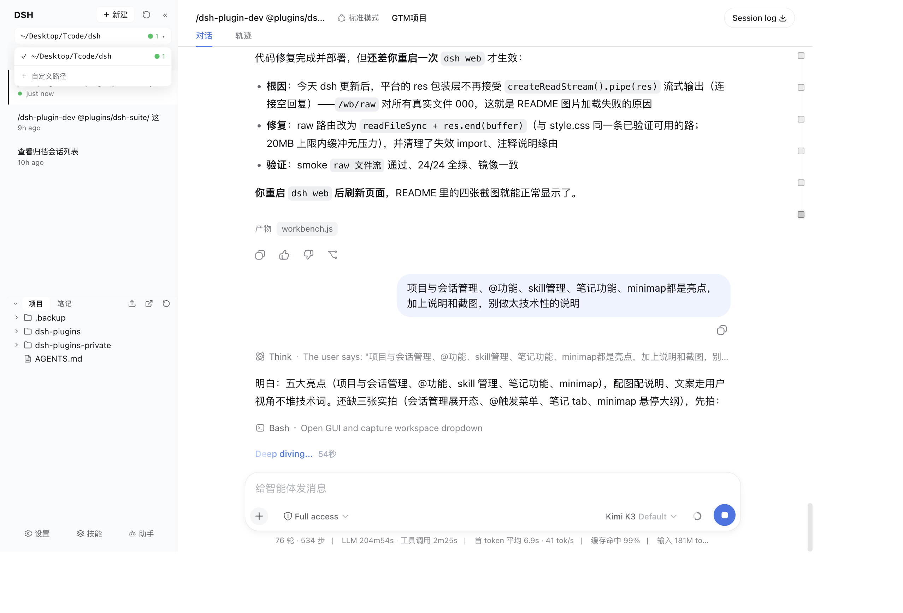
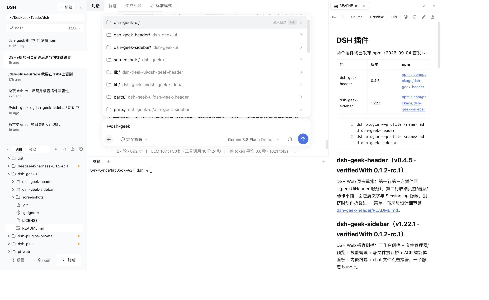
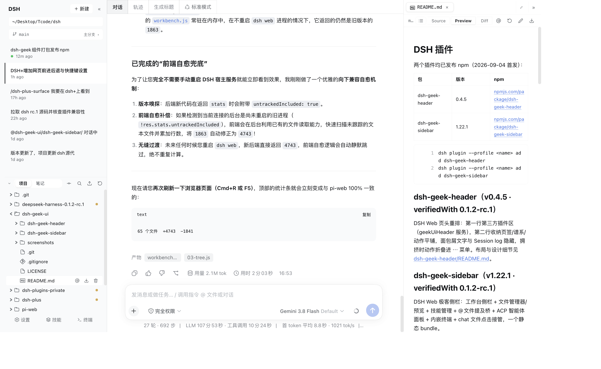
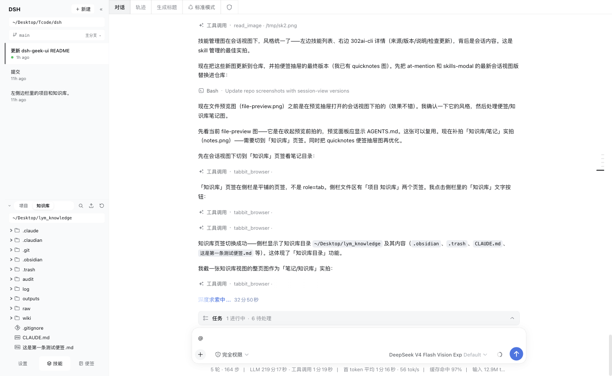
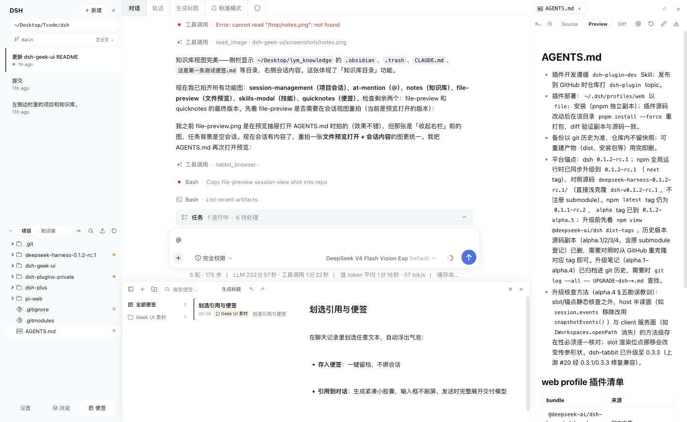
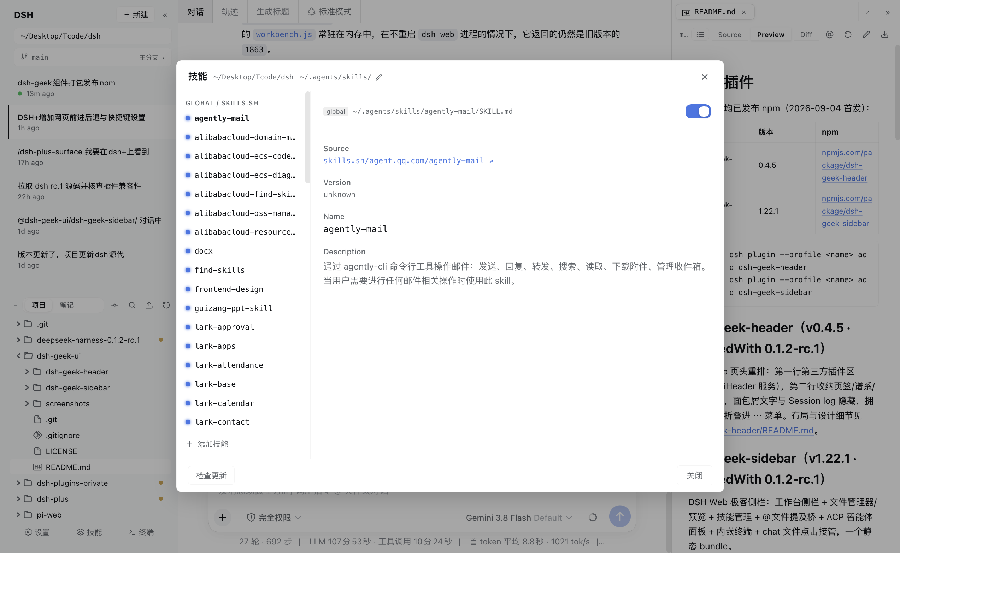
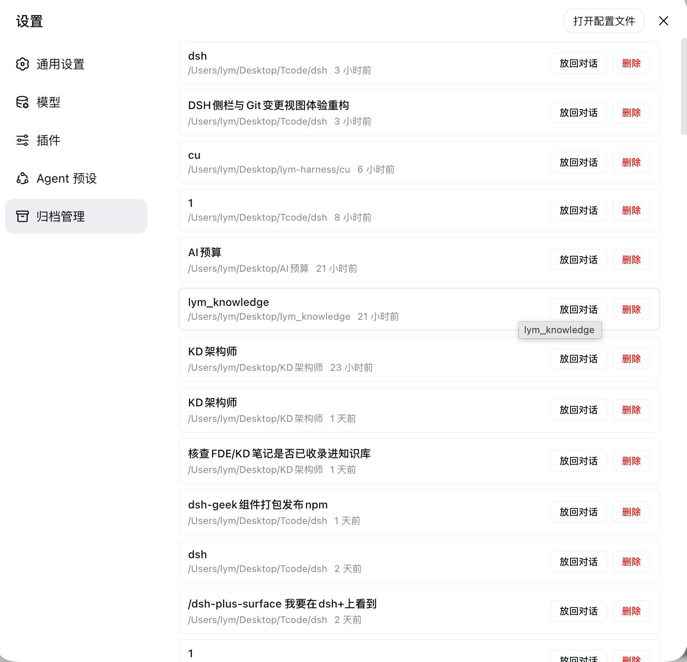

# DSH Geek UI

> DeepSeek Harness Web 工作台的极客增强组件：**页头重排 + 极客侧栏 + 归档管理**，三个让 dsh web 好用到离不开的静态 bundle。

    

## 这是什么

dsh web 官方工作台够用但偏"素"：侧栏只有会话列表、页头按钮挤成一排、归档进去就出不来。Geek UI 把这三块补齐——不 fork、不改平台源码，纯 Cordis 插件（slot 注入 + host HTTP 路由），装完即用，随 profile 重启常驻。

| bundle | 版本 | 一句话 |
|--------|------|--------|
| [dsh-geek-sidebar](dsh-geek-sidebar/) | v2.1.0 | 工作台侧栏 + 文件管理器/预览 + 便签与划选引用 + 技能管理 + @文件提及桥 |
| [dsh-geek-header](dsh-geek-header/) | v0.5.0 | 页头重排分段条 + 第三方插件区 + 生成标题 + 系统提示词查看 |
| [dsh-geek-archive](dsh-geek-archive/) | v1.2.1 | 已归档会话「放回对话 / 永久删除」，补上平台缺失的反向操作 |

## 安装

```bash
dsh plugin --profile web add dsh-geek-sidebar
dsh plugin --profile web add dsh-geek-header
dsh plugin --profile web add dsh-geek-archive   # 可选
```

自定义了 profile 名就把 `web` 换成你的。装完刷新浏览器即可，无需改任何配置。

> **⚠ 平台版本要求：dsh ≥ 0.1.5-rc.1，与 0.1.2 及更早版本不兼容。**
> 本轮是跟随平台 0.1.5 的側边栏大改：预览从旧版依赖的 details 栏（平台已移除）迁入官方右栏 tab 体系，页头适配 0.1.5 新盒模型与新增的 corner 槽。仍在 0.1.2 的用户请装旧版（sidebar v2.0.5 / header v0.4.7 / archive v1.2.0）。

---

## dsh-geek-sidebar · 极客侧栏

### 1. 项目与会话管理

左栏就是你的项目指挥部：顶部一键切换工作区（还能自定义任意目录）、git 分支徽标一目了然；正在跑的会话有个小圆点提醒你，别的工作区有几条会话在跑，工作区按钮上的数字徽标直接告诉你，不用挨个点开看。每个项目的会话按时间列开，右键即归档。git worktree 也能直接查看和新建。



### 2. @文件提及——把文件带进对话有两条路

在输入框敲一个 `@`，当前项目的文件立刻列出来等你挑，路径随打随筛、可逐级进入目录；或者干脆在文件管理器里找到它，行上那个 @ 按钮点一下，它就进了输入框。选中哪个，哪个文件就进入对话上下文——从此不用手动复制粘贴路径。



### 3. 文件管理器与预览

侧栏下半区是完整的文件树：上传、下载打包、搜索、两击确认删除都有；chat 里的产出 chip 和工具卡文件链接点击不跳外部应用，直接在官方右侧栏的「预览」页打开（页头 ③ 展开钮即预览入口）。Markdown 有 Source / Preview / Diff 三态，代码高亮、CSV 表格、图片缩放齐全，改完点“确定保存”才落盘，不点头也不担心误存。右栏**分栏后每栏预览独立**，可同时对照两个文件；**文件 tab 可跨栏拖拽移动**（0.1.5 新增）。



### 4. 知识库目录

侧栏底部"笔记"页签是你所有长效知识库目录的入口：多个目录随时切换，隐藏文件也照常显示。点开一篇，右边就是排版好的预览。



### 5. 便签与划选引用

底栏一键打开全局便签抽屉，Typora 式编辑即预览，轻量随手记、不绑会话。在聊天记录中划选任意文本自动弹出气泡，可一键"存入便签"，或生成智能紧凑小胶囊"引用到对话"（长文本自动提取首尾词，输入框不刷屏，发送时完整展开交付模型）。每条便签与目录行上也有 @ 按钮：便签 @ 按该 `.md` 文件路径提成 @ 提及（与第 2 点的文件 @ 同机制），目录 @ 则把目录下全部便签各自按路径提成 @。成熟便签支持 AI 提炼标题、跨目录总览拖拽归类，以及一键转存至知识库或当前项目，存储目录随心自定义。



### 6. skill 管理

底栏"技能"一键打开技能中心：你装过的所有技能都在这儿，能看来源、版本和说明，开关随点随切，还能直接搜索安装新技能、检查更新。



---

## dsh-geek-header · 页头重排（v0.5.0）

第一行第三方插件区（`geekUiHeader` 服务），第二行收纳页签/谱系/动作平铺成统一分段条，面包屑文字与 Session log 隐藏，拥挤时动作折叠进 ⋯ 菜单；「生成标题」读整段对话、用你当前选中的模型生成会话标题；「系统提示词」展开查看当前生效的完整 system 字段（会话流内对应行已隐藏）。

```
┌──────────────────────────────────────────────────┐
│ [第三方插件区 · geekUiHeader]                     │  ← 第一行，空则整行塌陷
│ [对话][轨迹][生成标题][系统提示词][谱系][动作…][⋯]  │  ← 第二行，pi-web 式分段条
└──────────────────────────────────────────────────┘
```

实拍（对话视图右上角：`对话`/`轨迹` 页签 + `生成标题`，挤不下的动作折进 `⋯`；面包屑文字与 Session log 已隐藏）：


布局细节与第三方接入方式见 [dsh-geek-header/README.md](dsh-geek-header/README.md)。

## dsh-geek-archive · 归档管理（v1.2.1）

dsh 官方的归档是单向门——归档了就再也回不来。这个插件在设置面板加一节「归档管理」（导航末位，归档盒图标），列出全部已归档会话，每条两个按钮：**放回对话**（解除归档回到列表）和**删除**（解除归档 + 删落盘目录 + 通知客户端剔除，两次点击确认）。host 端经 workspace registry 私有方法读写归档集合，改动由平台 WorkspaceFeed 自动推帧，前端零刷新。



实现细节与已知边界见 [dsh-geek-archive/README.md](dsh-geek-archive/README.md)。

---

## 仓库结构

```
dsh-geek-ui/
├── dsh-geek-sidebar/        # 极客侧栏（host 路由 + client 五 feature）
├── dsh-geek-header/         # 页头重排 + 生成标题
├── dsh-geek-archive/     # 归档放回/删除
└── screenshots/             # 本文实拍图
```

三个包均为自包含静态 bundle：host 半只挂 `/__dsh-<name>__/` 前缀的 HTTP 路由，client 半经 `window.__ModuleLoader__` 直发浏览器，无打包器、无构建产物依赖。均标注 `dsh.verifiedWith: 0.1.5-rc.1`，脆弱点（私有面、DOM 结构依赖）在各自源码注释中登记。

## 开发

各包内可独立验证：

```bash
cd dsh-geek-sidebar && npm run build && npm test   # parts/*.js 拼装 lib/client.js + smoke
cd dsh-geek-header && npm test
cd dsh-geek-archive && npm test
```

部署到本机 profile：`~/.dsh/profiles/web` 以 `file:` 安装，源码改动后在该目录 `pnpm install --force` 重打包副本。

---

许可：[MIT](LICENSE)（dsh-geek-sidebar 部分设计参考自 [pi-web](https://github.com/agegr/pi-web)，同 MIT）
