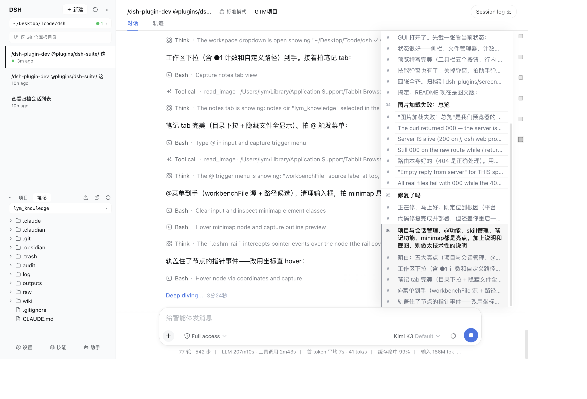

# DSH 插件

## dsh-geek-sidebar（v1.1.0 · verifiedWith 0.1.0-rc.7）

DSH Web 极客侧栏：工作台侧栏 + 文件管理器/预览 + 技能管理 + @文件提及桥，三 feature 一个静态 bundle。

### 四大亮点（实拍）

**1. 项目与会话管理**——左栏就是你的项目指挥部：一键切换工作区（还能自定义任意目录）、每个项目的会话一目了然。正在跑的会话有个小圆点提醒你，别的工作区有几条会话在跑，工作区按钮上的数字徽标直接告诉你，不用挨个点开看。git worktree 也能直接查看和新建。

**2. @功能**——把文件带进对话有两条路，随你顺手：在输入框敲一个 `@`，当前项目的文件立刻列出来等你挑，路径随打随筛；或者干脆在文件管理器里找到它，行上那个 @ 按钮点一下，它就进了输入框。选中哪个，哪个文件就进入对话上下文——从此不用手动复制粘贴路径。

**3. 笔记功能**——侧栏底部的"笔记"页签是你所有笔记目录的入口：多个目录随时切换，隐藏文件也照常显示。点开一篇，右边就是排版好的预览；随手就能改，改完点"确定保存"才落盘，不点头也不担心误存。

**4. skill 管理**——底栏"技能"一键打开技能中心：你装过的所有技能都在这儿，能看来源、版本和说明，开关随点随切，还能直接搜索安装新技能、检查更新。

### 功能清单

- **侧栏**：工作区选择/自定义路径、会话列表（运行/待交互圆点、重命名全选、删除/归档）、全局会话计数徽标（进行中/待交互，tooltip 拆解当前工作区）、blank（未发消息）会话不入列表、git worktree 一览/新建/删除
- **文件管理器（项目/笔记）**：目录树、隐藏文件显示（仅屏蔽 .DS_Store）、上传/下载（目录打包 zip）、**删除至回收站**（行内二次确认，mac ~/.Trash · Linux XDG · Windows 应用级）、@提及到输入框、折叠时点 tab 自动展开
- **文件预览**：多标签、Markdown（大纲/本地图片与内链）、代码高亮、CSV、图片/PDF/docx（docx 仅 macOS）；**编辑模式**（"确定保存"才落盘）、窗口聚焦自动重读、手动刷新；窄窗口（<1220px）改右侧抽屉
- **details 面板驱动管理器**：`dshDetailsPanels` 服务（register/open/close/isOpen），替换式弹出——驱动激活整体替换右栏，关闭回预览；外来裸注册插件（如 dsh-gtm）按 priority 轮值让位；点文件自动请当前占用者退场
- **助手弹层**：底栏按钮向上弹出的智能体列（ACP/A2A 占位），极简无头、高度自适应、宽度拖拽并 localStorage 记忆
- **技能管理弹窗**：扫描 global/project 技能、frontmatter 开关、npx 安装/更新、skills.sh 搜索、GitHub trees + git fetch 兜底的版本比对、globalDir 偏好
- **@文件提及桥**：`dshFileMention` 服务，经平台输入机 CAS 受管写入（防并发写冲突）
- **工程**：纯 JS 单文件 client（`parts/` 可读源码按序拼接，`parts/build.mjs` 纯拼接器）；host 路由 `/__dsh-geek-sidebar__/{skills,wb}/*`；`Config` 可调参数（textMaxKB/rawMaxMB/writeMaxMB/notesMaxDirs/gitCacheTtlSec/findFilesMaxLimit）；跨 macOS/Windows/Linux（选择器/回收站/zip/reveal/npx 按平台分支）；`parts/smoke.mjs` 24 项 host + client 断言

## dsh-chat-minimap（v0.1.1 · verifiedWith 0.1.0-rc.7）

长对话的导航地图：会话右缘一排小方块，每个方块是一条你的发言。鼠标悬停即展开整段对话的大纲（哪条是你说的、AI 答了什么），点击方块或标题平滑滚动到对应位置，轨道支持按压拖动快速浏览——几百轮的对话也能秒回上下文。

pi-web ChatMinimap 复刻，纯 client 实现（host 为空壳），副作用全部随 React effect 回收。

---

许可：[MIT](LICENSE)（dsh-geek-sidebar 与 dsh-chat-minimap 部分设计参考自 [pi-web](https://github.com/agegr/pi-web)，同 MIT）
